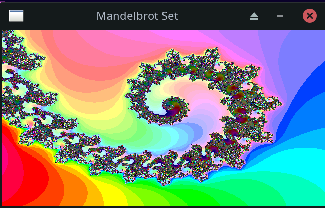

# mandelbrots

In 1989 I wrote a math thesis on fractals and computed views of the Mandelbrot set
based on the book The Beauty of Fractals.

Computation took literally hours. The code here is my attempt to see how much faster
computers are today, and how much systems like CoPilot and ChatGPT can make the coding 
process easier.

Answer: a whole lot.

The speedup from my lousy BASIC code in 1989 to parallel Rust in 2023 is over 1 million times.

(Mandelbrots in Time - Sheet1.pdf)

Spreadsheet also here:

https://docs.google.com/spreadsheets/d/1bUzblDCEffGtFhBnV9n7ZmAWqEKKS1V7aeNJAy_CK9c/edit?usp=sharing